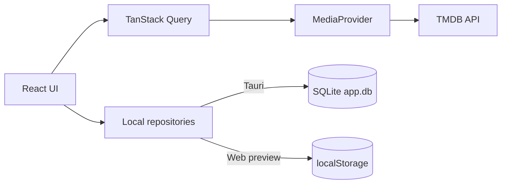

# 🎬 CineTrack

**A local-first desktop application for discovering, organising, and tracking films and TV series.**

[](https://tauri.app/)
[](https://react.dev/)
[](https://www.typescriptlang.org/)
[](https://pnpm.io/)

CineTrack is a desktop MVP built with **Tauri**, **React**, **TypeScript**, and **SQLite**. It uses the [TMDB](https://www.themoviedb.org/) catalogue to explore films and TV series while keeping your watchlist, viewing progress, and activity history on your device.

> [!NOTE]
> The interface is currently available in English. The internationalisation architecture is already in place for adding more languages.

## ✨ Features

### Discover

- Browse popular, top-rated, currently airing, and upcoming films and TV series.
- Explore the catalogue by genre and streaming provider.
- Search films and TV series together, with filters by media type.
- View detailed media pages with synopses, cast members, genres, status, and technical information.

### Organise

- Add films and TV series to your watchlist or remove them at any time.
- Filter and sort your watchlist by media type, date, title, or rating.
- Mark films as watched or unwatched.
- Review recent actions in a local activity timeline.

### Track TV series

- Mark individual episodes as watched or unwatched.
- Mark an entire season or series at once.
- View overall and season-by-season progress.
- Quickly resume series already in progress from the home page.

### Personalise

- Switch between light and dark themes.
- Choose from several accent colours.
- Enable compact mode or reduced motion.
- Set default filters for search and the watchlist.

## 🧱 Technology stack

| Area | Technologies |
| --- | --- |
| Desktop application | Tauri 2, Rust |
| Frontend | React 18, TypeScript, Vite |
| Styling and components | Tailwind CSS, Radix UI, local components inspired by shadcn/ui |
| Routing | TanStack Router |
| Remote data | TanStack Query, TMDB API |
| Desktop persistence | SQLite through `@tauri-apps/plugin-sql` |
| Web preview | `localStorage` with a local JSON store |
| UI state | Zustand |
| Validation | Zod |
| Internationalisation | i18next, react-i18next |
| Animation and icons | Framer Motion, Lucide React |

## 🏗️ Architecture

The remote catalogue and personal data are deliberately kept separate:



- `MediaProvider` abstracts catalogue access, making it possible to replace TMDB without coupling the interface to its API.
- Local repositories manage the watchlist, progress, activity history, and preferences.
- In Tauri, data is stored in `sqlite:app.db`.
- In the browser, a `localStorage` fallback makes it possible to test the interface without starting the desktop application.

## 📦 Prerequisites

Before getting started, install:

- [Node.js](https://nodejs.org/) and Corepack;
- [pnpm](https://pnpm.io/) — the project specifies `pnpm@10.6.5`;
- the [Rust](https://www.rust-lang.org/tools/install) toolchain;
- the [Tauri system prerequisites](https://v2.tauri.app/start/prerequisites/) for your platform;
- a TMDB account and an **API Read Access Token**.

Check that your environment is ready:

```bash
node --version
pnpm --version
rustc --version
cargo --version
```

## 🚀 Installation

### 1. Clone the repository

```bash
git clone https://github.com/Arrows78/cinetrack.git
cd cinetrack
```

### 2. Install dependencies

```bash
corepack enable
pnpm install
```

### 3. Configure TMDB

Copy the example environment file:

```bash
cp .env.example .env
```

Then add your token to `.env`:

```dotenv
VITE_TMDB_API_TOKEN=your_tmdb_bearer_token_here
```

The application expects the TMDB **API Read Access Token**, which is sent as a Bearer token to the TMDB API.

### 4. Start the desktop application

```bash
pnpm tauri dev
```

This command starts the Vite server on port `1420`, initialises the SQLite database, and opens the Tauri window.

## 🌐 Web preview

To work on the interface without starting Tauri:

```bash
pnpm dev
```

The application is then available at `http://localhost:1420`.

> [!IMPORTANT]
> Browser mode stores data in `localStorage` under the `cinetrack.browser-store` key. It is intended to simplify development; the primary target remains the Tauri desktop application backed by SQLite.

## 🛠️ Scripts

| Command | Description |
| --- | --- |
| `pnpm dev` | Starts the Vite development server. |
| `pnpm build` | Checks TypeScript types and creates the frontend production build. |
| `pnpm preview` | Serves the Vite production build locally. |
| `pnpm lint` | Analyses the project with ESLint. |
| `pnpm format` | Formats files with Prettier. |
| `pnpm tauri dev` | Starts the desktop application in development mode. |
| `pnpm tauri build` | Creates desktop bundles for the current platform. |

Generated Tauri bundles are written to `src-tauri/target/release/bundle/`.

## 📂 Project structure

```text
cinetrack/
├── src/
│   ├── app/                    # Application setup, router, and QueryClient
│   ├── components/
│   │   ├── layout/             # Application shell, navigation, and theme handling
│   │   ├── media/              # Media cards, grids, progress, and details
│   │   ├── states/             # Empty states and loading skeletons
│   │   └── ui/                 # Local UI primitives
│   ├── hooks/                  # Catalogue, search, and local-data hooks
│   ├── i18n/                   # Internationalisation setup and translations
│   ├── pages/                  # Application pages and screens
│   ├── services/
│   │   ├── api/tmdb/           # TMDB client, types, and data mapping
│   │   ├── local/              # SQLite, web fallback, and local repositories
│   │   ├── providers/          # MediaProvider contract and TMDB implementation
│   │   └── repositories/       # Catalogue access layer
│   ├── shared/                 # Configuration, constants, and utilities
│   ├── store/                  # Lightweight global state with Zustand
│   ├── styles/                 # Global styles and themes
│   └── types/                  # Domain models
├── src-tauri/
│   ├── capabilities/           # Tauri permissions
│   ├── src/                    # Rust entry points
│   ├── Cargo.toml              # Rust dependencies
│   └── tauri.conf.json         # Desktop configuration and bundle settings
├── .env.example
├── package.json
└── README.md
```

## 💾 Local persistence

CineTrack does not require a user account or an application server to save personal data.

In desktop mode, the SQLite schema includes the following tables:

- `watchlist`;
- `seen_movies`;
- `tracked_series`;
- `episode_progress`;
- `activity_log`;
- `preferences`.

Catalogue data, posters, and metadata are loaded from TMDB, so they require an internet connection and a valid API token.

## 🗺️ Roadmap

- [ ] Add onboarding for configuring the TMDB token inside the application.
- [ ] Add more advanced viewing statistics.
- [ ] Create a release and upcoming-episode calendar.
- [ ] Add favourites alongside the watchlist.
- [ ] Persist the TanStack Query cache for a better offline experience.
- [ ] Add desktop keyboard shortcuts.
- [ ] Add more translations.
- [ ] Introduce automated tests and continuous integration.

## 🙌 Contributing

Issues and pull requests are welcome, whether you are fixing a bug, improving the documentation, or proposing a feature.

Before submitting a change, run:

```bash
pnpm lint
pnpm build
```

## 🎞️ TMDB attribution

CineTrack uses data and images provided by TMDB.

> This product uses the TMDB API but is not endorsed or certified by TMDB.

Review the [TMDB documentation](https://developer.themoviedb.org/docs/getting-started) and [attribution requirements](https://developer.themoviedb.org/docs/faq) before publicly distributing or commercially using the application.
