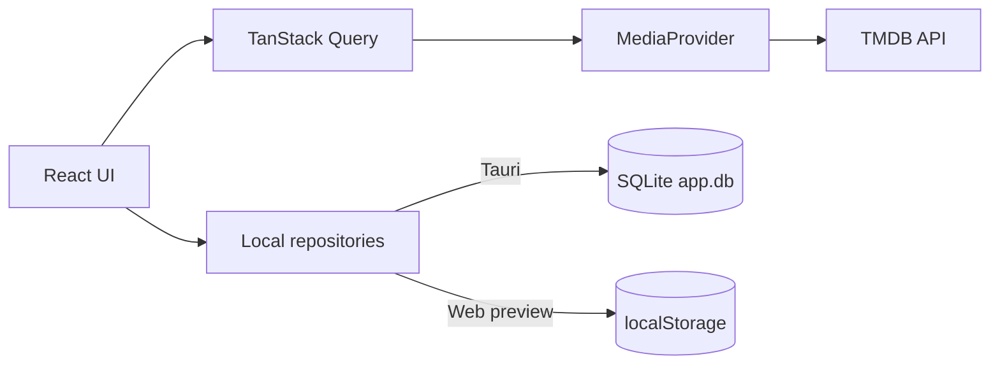

# 🎬 CineTrack

**A local-first desktop application for discovering, organising, and tracking films and TV series.**

[](https://tauri.app/)
[](https://react.dev/)
[](https://www.typescriptlang.org/)
[](https://pnpm.io/)
[](LICENSE)

CineTrack is a local-first desktop application built with **Tauri**, **React**, **TypeScript**, and **SQLite**. It uses the [TMDB](https://www.themoviedb.org/) catalogue to explore films and TV series while keeping your watchlist, viewing progress, and activity history on your device.

> [!NOTE]
> The interface is available in English and French, with the internationalisation architecture in place for adding more languages.

## ✨ Features

### Discover

- Browse popular, top-rated, currently airing, and upcoming films and TV series.
- Explore the catalogue by genre and streaming provider, or get a random pick with "Watch tonight".
- Search films and TV series together, with filters by media type.
- View detailed media pages with synopses, cast members, genres, status, trailers, recommendations, and streaming availability by region.

### Organise

- Add films and TV series to your watchlist, a unified library (planned/watching/completed/dropped/rewatching), or custom lists.
- Filter and sort your watchlist and library by media type, status, date, title, or rating.
- Mark films as watched or unwatched, rate and tag titles, and mark favourites.
- Review recent actions in a local activity timeline.
- Manage multiple local profiles, each with its own watchlist, library, and history.

### Track TV series

- Mark individual episodes as watched or unwatched.
- Mark an entire season or series at once.
- View overall and season-by-season progress.
- Quickly resume series already in progress from the home page.
- Get notified when a release date or new episode is coming up via the calendar, and set streaming-availability alerts.

### Personalise

- Switch between light and dark themes and several accent colours.
- Enable compact mode or reduced motion.
- Set default filters for search and the watchlist.
- Sign in with Supabase (email OTP or social OAuth) when account sync is configured; the app otherwise works fully offline with a local-only profile.
- Review viewing statistics and a yearly "wrapped" summary.

## 🧱 Technology stack

| Area                   | Technologies                                                    |
| ---------------------- | --------------------------------------------------------------- |
| Desktop application    | Tauri 2, Rust                                                   |
| Frontend               | React 19, TypeScript, Vite                                      |
| Styling and components | Tailwind CSS, Radix UI, local components inspired by shadcn/ui  |
| Routing                | TanStack Router                                                 |
| Remote data            | TanStack Query, TMDB API                                        |
| Optional account sync  | Supabase Auth (email OTP, OAuth)                                |
| Desktop persistence    | SQLite through `@tauri-apps/plugin-sql`, Stronghold for secrets |
| Web preview            | `localStorage` with a local JSON store                          |
| UI state               | Zustand                                                         |
| Validation             | Zod                                                             |
| Internationalisation   | i18next, react-i18next (English, French)                        |
| Animation and icons    | Framer Motion, Lucide React                                     |
| Testing                | Vitest, Testing Library, `cargo test`                           |

## 🏗️ Architecture

The remote catalogue and personal data are deliberately kept separate:



- `MediaProvider` abstracts catalogue access, making it possible to replace TMDB without coupling the interface to its API.
- Local repositories (one per domain: watchlist, library, progress, history, preferences, profiles, collections, availability, stats) manage personal data.
- In Tauri, data is stored in `sqlite:app.db`.
- In the browser, a `localStorage` fallback makes it possible to test the interface without starting the desktop application. Every repository implements both branches so behavior is identical either way.

## 📦 Prerequisites

Before getting started, install:

- [Node.js](https://nodejs.org/) and Corepack;
- [pnpm](https://pnpm.io/) — the project specifies `pnpm@10.6.5`;
- the [Rust](https://www.rust-lang.org/tools/install) toolchain;
- the [Tauri system prerequisites](https://v2.tauri.app/start/prerequisites/) for your platform;
- a TMDB account and an **API Read Access Token**.

Check that your environment is ready:

```bash
node --version
pnpm --version
rustc --version
cargo --version
```

## 🚀 Installation

### 1. Clone the repository

```bash
git clone https://github.com/Arrows78/cinetrack.git
cd cinetrack
```

### 2. Install dependencies

```bash
corepack enable
pnpm install
```

### 3. Configure TMDB

Copy the example environment file:

```bash
cp .env.example .env
```

Then add your token to `.env`:

```dotenv
VITE_TMDB_API_TOKEN=your_tmdb_bearer_token_here
```

The application expects the TMDB **API Read Access Token**, which is sent as a Bearer token to the TMDB API.

> **Security note:** `VITE_TMDB_API_TOKEN` is inlined by Vite into the frontend bundle at build time. Keep it set in `.env` only for local/web development. Never set it when producing a desktop bundle for distribution (`pnpm tauri build`) — a value present at that time would ship in cleartext inside the built binary, bypassing the Stronghold vault. Distributed builds should rely solely on the in-app token vault (Settings → TMDB) or leave the variable unset.

### 4. (Optional) Configure Supabase account sync

CineTrack works fully offline with `VITE_AUTH_REQUIRED=false` (the default). To enable account sign-in (email OTP or social OAuth), follow [`docs/auth.md`](docs/auth.md) for the full Supabase project setup, redirect URLs, and provider configuration.

### 5. Start the desktop application

```bash
pnpm tauri dev
```

This command starts the Vite server on port `1420`, initialises the SQLite database, and opens the Tauri window.

## 🌐 Web preview

To work on the interface without starting Tauri:

```bash
pnpm dev
```

The application is then available at `http://localhost:1420`.

> [!IMPORTANT]
> Browser mode stores data in `localStorage` under the `cinetrack.browser-store` key. It is intended to simplify development; the primary target remains the Tauri desktop application backed by SQLite.

## 🛠️ Scripts

| Command              | Description                                                        |
| -------------------- | ------------------------------------------------------------------ |
| `pnpm dev`           | Starts the Vite development server.                                |
| `pnpm build`         | Checks TypeScript types and creates the frontend production build. |
| `pnpm preview`       | Serves the Vite production build locally.                          |
| `pnpm lint`          | Analyses the project with ESLint.                                  |
| `pnpm format`        | Formats files with Prettier.                                       |
| `pnpm test`          | Runs the Vitest test suite.                                        |
| `pnpm test:coverage` | Runs the test suite with a coverage report.                        |
| `pnpm typecheck`     | Checks TypeScript types without emitting output.                   |
| `pnpm tauri dev`     | Starts the desktop application in development mode.                |
| `pnpm tauri build`   | Creates desktop bundles for the current platform.                  |

For the Rust side, run `cargo check --manifest-path src-tauri/Cargo.toml` and `cargo test --manifest-path src-tauri/Cargo.toml` (both also run in CI).

Generated Tauri bundles are written to `src-tauri/target/release/bundle/`.

## 📂 Project structure

```text
cinetrack/
├── src/
│   ├── app/                    # Application setup, router, and QueryClient
│   ├── components/             # Presentational UI: layout, media, ui/, states/, settings, collections, desktop, library
│   ├── db/                     # SQLite/localStorage connection and versioned migrations (shared by every feature)
│   ├── features/                # One folder per domain, each bundling its repository/service with the hooks that use it
│   │   ├── auth/                #   Supabase session, OAuth, email OTP
│   │   ├── availability/        #   Streaming-availability alerts and background monitor
│   │   ├── backup/              #   Portable JSON export/import, automatic backups
│   │   ├── calendar/            #   Release and episode calendar
│   │   ├── collections/         #   Profiles and custom lists
│   │   ├── desktop/             #   Tray/deep-link wiring, updater, notifications, TMDB token vault
│   │   ├── history/              #   Local activity timeline
│   │   ├── library/              #   Unified watch status, ratings, tags
│   │   ├── media/                #   TMDB client + MediaProvider, search/discovery hooks, image cache
│   │   ├── preferences/          #   Theme, language, region, and other user settings
│   │   ├── progress/              #   Movie/episode watched state and series progress
│   │   ├── stats/                #   Viewing statistics and yearly wrap-up
│   │   ├── watch-tonight/        #   Random pick service
│   │   └── watchlist/             #   Watchlist repository and hooks
│   ├── hooks/                   # Generic, repository-free hooks (debounce, confetti)
│   ├── i18n/                    # Internationalisation setup and translations
│   ├── pages/                   # Route components composed from feature hooks
│   ├── shared/                  # Configuration, constants, and utilities
│   ├── store/                   # Lightweight global state with Zustand
│   ├── styles/                  # Global styles and themes
│   └── types/                   # Domain models
├── src-tauri/
│   ├── capabilities/           # Tauri permissions
│   ├── src/
│   │   ├── commands/           # Tauri commands (TMDB proxy, updater config check)
│   │   ├── tray.rs              # System tray icon and menu
│   │   ├── lib.rs                # Plugin registration and app bootstrap
│   │   └── main.rs
│   ├── Cargo.toml              # Rust dependencies
│   └── tauri.conf.json         # Desktop configuration and bundle settings
├── .env.example
├── package.json
└── README.md
```

## 💾 Local persistence

CineTrack does not require a user account or an application server to save personal data.

In desktop mode, the active SQLite schema (see `src/db/migrations/`, one file per version) includes, among others:

- `profiles`, `preferences`;
- `profile_watchlist`, `library_items`, `viewing_events`, `profile_episode_progress`, `profile_tracked_series`;
- `custom_lists`, `custom_list_items`;
- `availability_alerts`, `availability_snapshots`;
- `activity_log`.

(The original pre-profile tables — `watchlist`, `seen_movies`, `tracked_series`, `episode_progress` — still exist in the schema for backward-compatible migrations but are no longer written to.)

Catalogue data, posters, and metadata are loaded from TMDB, so they require an internet connection and a valid API token.

## 🗺️ Roadmap

- [ ] Code-split the frontend bundle (the main chunk currently exceeds Vite's 500 kB warning threshold).
- [ ] Add more translations beyond English and French.

## 🙌 Contributing

Issues and pull requests are welcome, whether you are fixing a bug, improving the documentation, or proposing a feature.

Before submitting a change, run:

```bash
pnpm lint
pnpm typecheck
pnpm test
pnpm build
cargo check --manifest-path src-tauri/Cargo.toml
cargo test --manifest-path src-tauri/Cargo.toml
```

## 🎞️ TMDB attribution

CineTrack uses data and images provided by TMDB.

> This product uses the TMDB API but is not endorsed or certified by TMDB.

Review the [TMDB documentation](https://developer.themoviedb.org/docs/getting-started) and [attribution requirements](https://developer.themoviedb.org/docs/faq) before publicly distributing or commercially using the application.

## 📄 License

MIT — see [LICENSE](LICENSE).
