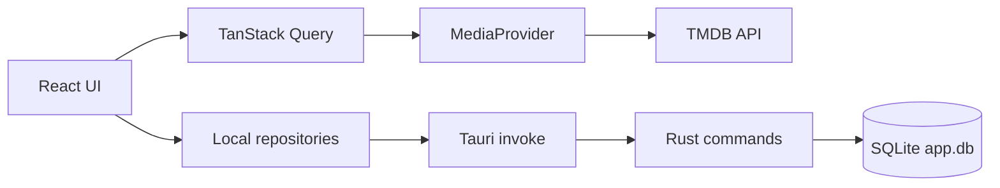

# 🎬 CineTrack

**A local-first desktop application for discovering, organising, and tracking films and TV series.**

[](https://tauri.app/)
[](https://react.dev/)
[](https://www.typescriptlang.org/)
[](https://pnpm.io/)
[](LICENSE)

CineTrack is a local-first desktop application built with **Tauri**, **React**, **TypeScript**, and **SQLite**. It uses the [TMDB](https://www.themoviedb.org/) catalogue to explore films and TV series while keeping your library, viewing progress, and activity history on your device.

> [!NOTE]
> The interface is available in English and French, with the internationalisation architecture in place for adding more languages.

## ✨ Features

### Discover

- Browse popular, top-rated, currently airing, and upcoming films and TV series.
- Explore the catalogue by genre and streaming provider, or get a random pick with "Watch tonight".
- Search films and TV series together, with filters by media type.
- View detailed media pages with synopses, cast members, genres, status, trailers, recommendations, and streaming availability by region.

### Organise

- Add films and TV series to your library (planned/watching/paused/completed/dropped) or custom lists.
- Filter and sort your library by media type, status, date, title, or rating.
- Mark films as watched or unwatched, rate and tag titles, and mark favourites.
- Review recent actions in a local activity timeline.
- Manage multiple profiles, each with its own library and history — switch, create, or remove local-only profiles freely offline; with optional Supabase sign-in configured (see "Personalise" below), a profile can also be linked to an account so it's only reachable by that account.
- Import a TV Time GDPR export (watched episodes and movies with their original dates, plus the to-watch list) as a one-time bulk migration.

### Track TV series

- Mark individual episodes as watched or unwatched.
- Mark an entire season or series at once.
- View overall and season-by-season progress.
- Quickly resume series already in progress from the home page.
- Get notified when a release date or new episode is coming up via the calendar, and set streaming-availability alerts.

### Personalise

- Switch between light and dark themes and several accent colours.
- Enable compact mode or reduced motion.
- Set a default filter for search.
- Sign in with Supabase (email OTP or social OAuth) when optional sign-in is configured; the app otherwise works fully offline with a local-only profile.
- Review viewing statistics and a yearly "wrapped" summary.

## 🧱 Technology stack

| Area                   | Technologies                                                           |
| ---------------------- | ---------------------------------------------------------------------- |
| Desktop application    | Tauri 2, Rust                                                          |
| Frontend               | React 19, TypeScript, Vite                                             |
| Styling and components | Tailwind CSS, Radix UI, local components inspired by shadcn/ui         |
| Routing                | TanStack Router                                                        |
| Remote data            | TanStack Query, TMDB API                                               |
| Optional sign-in       | Supabase Auth (email OTP, OAuth)                                       |
| Desktop persistence    | SQLite via Rust (`sqlx`) behind Tauri commands, Stronghold for secrets |
| UI state               | Zustand                                                                |
| Validation             | Zod                                                                    |
| Internationalisation   | i18next, react-i18next (English, French)                               |
| Animation and icons    | Framer Motion, Lucide React                                            |
| Testing                | Vitest, Testing Library, `cargo test`                                  |

## 🏗️ Architecture

The remote catalogue and personal data are deliberately kept separate:



- `MediaProvider` abstracts catalogue access, making it possible to replace TMDB without coupling the interface to its API.
- Local repositories (one per domain: library, progress, history, preferences, profiles, collections, availability, stats, …) are thin `invoke()` wrappers; the actual SQL, transactions, and cascades live in Rust commands (`src-tauri/src/commands/`), all of it in SQLite (`sqlite:app.db`).
- SQLite is only reachable from inside the Tauri webview — a plain browser tab has no access to Tauri's IPC bridge, even when it's pointed at the same dev server `pnpm tauri dev` uses. Every local-data hook already tolerates a failed query (none use React Query's suspense mode), so the UI still renders outside Tauri for layout/styling work; reads/writes to SQLite just fail silently. A small non-blocking banner flags this, see [`src/components/desktop/browser-preview-banner.tsx`](src/components/desktop/browser-preview-banner.tsx).

See [`docs/architecture.md`](docs/architecture.md) for the full request-to-database walkthrough (the Rust command → repository → hook → page shape every domain follows), the error-handling contract, and how to add a new feature domain. See [`docs/design-system.md`](docs/design-system.md) for UI tokens and component rules, and [`docs/auth.md`](docs/auth.md) for the optional Supabase account-sync setup.

## 📦 Prerequisites

Before getting started, install:

- [Node.js](https://nodejs.org/) and Corepack;
- [pnpm](https://pnpm.io/) — the project specifies `pnpm@10.6.5`;
- the [Rust](https://www.rust-lang.org/tools/install) toolchain;
- the [Tauri system prerequisites](https://v2.tauri.app/start/prerequisites/) for your platform;
- a TMDB account and an **API Read Access Token**.

Check that your environment is ready:

```bash
node --version
pnpm --version
rustc --version
cargo --version
```

## 🚀 Installation

### 1. Clone the repository

```bash
git clone https://github.com/Arrows78/cinetrack.git
cd cinetrack
```

### 2. Install dependencies

```bash
corepack enable
pnpm install
```

### 3. Configure TMDB

Copy the example environment file:

```bash
cp .env.example .env
```

Then add your token to `.env`:

```dotenv
VITE_TMDB_API_TOKEN=your_tmdb_bearer_token_here
```

The application expects the TMDB **API Read Access Token**, which is sent as a Bearer token to the TMDB API.

> **Security note:** `VITE_TMDB_API_TOKEN` is inlined by Vite into the frontend bundle at build time. Keep it set in `.env` only for local/web development. Never set it when producing a desktop bundle for distribution (`pnpm tauri build`) — a value present at that time would ship in cleartext inside the built binary, bypassing the Stronghold vault. Distributed builds should rely solely on the in-app token vault (Settings → TMDB) or leave the variable unset.

### 4. (Optional) Configure Supabase sign-in

CineTrack works fully offline with `VITE_AUTH_REQUIRED=false` (the default). To enable account sign-in (email OTP or social OAuth), follow [`docs/auth.md`](docs/auth.md) for the full Supabase project setup, redirect URLs, and provider configuration.

### 5. Start the desktop application

```bash
pnpm tauri dev
```

This command starts the Vite server on port `1420`, initialises the SQLite database, and opens the Tauri window.

## 🌐 About `pnpm dev`

`pnpm dev` (used internally by `pnpm tauri dev` to serve the frontend, and also runnable on its own) starts the same Vite server on `http://localhost:1420` — but CineTrack's only persistence layer is SQLite, reachable exclusively from inside the Tauri webview. A plain browser tab has no access to Tauri's IPC bridge, even when it's pointed at that same URL while `pnpm tauri dev` is running.

> [!NOTE]
> Opening `http://localhost:1420` outside the Tauri window — `pnpm dev` on its own, or a regular browser tab while `pnpm tauri dev` runs — still renders the full UI (useful for quick layout/styling iteration), with a small banner flagging that SQLite reads/writes won't work. Use the Tauri window (`pnpm tauri dev`) or the installed desktop application whenever you need real data.

## 🛠️ Scripts

| Command                   | Description                                                                                                               |
| ------------------------- | ------------------------------------------------------------------------------------------------------------------------- |
| `pnpm dev`                | Starts the Vite development server.                                                                                       |
| `pnpm build`              | Checks TypeScript types and creates the frontend production build.                                                        |
| `pnpm preview`            | Serves the Vite production build locally.                                                                                 |
| `pnpm lint`               | Analyses the project with ESLint.                                                                                         |
| `pnpm lint:fix`           | Analyses the project with ESLint and applies automatic fixes.                                                             |
| `pnpm format`             | Formats files with Prettier.                                                                                              |
| `pnpm format:check`       | Checks formatting without writing changes (what CI runs).                                                                 |
| `pnpm test`               | Runs the Vitest test suite.                                                                                               |
| `pnpm test:watch`         | Runs the Vitest test suite in watch mode.                                                                                 |
| `pnpm test:coverage`      | Runs the test suite with a coverage report.                                                                               |
| `pnpm typecheck`          | Checks TypeScript types without emitting output.                                                                          |
| `pnpm cargo:check`        | Runs `cargo check` on the Rust side.                                                                                      |
| `pnpm cargo:clippy`       | Runs `cargo clippy --all-targets -- -D warnings` on the Rust side.                                                        |
| `pnpm cargo:clippy:fix`   | Runs `cargo clippy` on the Rust side and applies automatic fixes.                                                         |
| `pnpm cargo:format`       | Formats the Rust side with `rustfmt`.                                                                                     |
| `pnpm cargo:format:check` | Checks Rust formatting without writing changes (what CI runs).                                                            |
| `pnpm cargo:test`         | Runs `cargo test` on the Rust side.                                                                                       |
| `pnpm cargo:coverage`     | Runs `cargo llvm-cov --branch` for per-file Rust coverage (needs a `nightly` toolchain — see `CLAUDE.md`; not run in CI). |
| `pnpm validate:frontend`  | Runs `lint`, `format:check`, `typecheck`, `test:coverage`, and `build`.                                                   |
| `pnpm validate:backend`   | Runs `cargo:check`, `cargo:clippy`, `cargo:format:check`, and `cargo:test`.                                               |
| `pnpm validate`           | Runs `validate:frontend` then `validate:backend` — the full chain, and the same checks CI runs.                           |
| `pnpm tauri dev`          | Starts the desktop application in development mode.                                                                       |
| `pnpm tauri build`        | Creates desktop bundles for the current platform.                                                                         |

For the Rust side, use `pnpm cargo:check`, `pnpm cargo:clippy`, `pnpm cargo:format:check`, and `pnpm cargo:test` (all four also run in CI).

Generated Tauri bundles are written to `src-tauri/target/release/bundle/`.

## 📂 Project structure

```text
cinetrack/
├── src/
│   ├── app/                    # Application setup, router, and QueryClient
│   ├── components/             # Presentational UI: layout, media, ui/, states/, settings, collections, desktop, library
│   ├── db/                     # Migration schema + real-SQLite test harness (production reads/writes go through src-tauri/src/commands, not this)
│   ├── features/                # One folder per domain, each bundling its repository/service with the hooks that use it
│   │   ├── auth/                #   Supabase session, OAuth, email OTP
│   │   ├── availability/        #   Streaming-availability alerts and background monitor
│   │   ├── backup/              #   Portable JSON export/import, automatic backups
│   │   ├── calendar/            #   Release and episode calendar
│   │   ├── collections/         #   Profiles and custom lists
│   │   ├── desktop/             #   Tray/deep-link wiring, updater, notifications, TMDB token vault
│   │   ├── diagnostics/          #   In-app diagnostic logger
│   │   ├── history/              #   Local activity timeline
│   │   ├── library/              #   Unified watch status, ratings, tags
│   │   ├── media/                #   TMDB client + MediaProvider, search/discovery hooks, image cache
│   │   ├── preferences/          #   Theme, language, region, and other user settings
│   │   ├── progress/              #   Movie/episode watched state and series progress
│   │   ├── stats/                #   Viewing statistics and yearly wrap-up
│   │   ├── tvtime/                #   One-time bulk import from a TV Time export
│   │   └── watch-tonight/        #   Random pick service
│   ├── hooks/                   # Generic, repository-free hooks (debounce, confetti)
│   ├── i18n/                    # Internationalisation setup and translations
│   ├── pages/                   # Route components composed from feature hooks
│   ├── shared/                  # Configuration, constants, and utilities
│   ├── store/                   # Lightweight global state with Zustand
│   ├── styles/                  # Global styles and themes
│   └── types/                   # Domain models
├── src-tauri/
│   ├── capabilities/           # Tauri permissions
│   ├── src/
│   │   ├── commands/            # One file per domain: SQL, transactions, cascades, active-profile resolution
│   │   ├── database/             # Connection pool setup and the schema migrations (squashed initial schema + later fixes)
│   │   ├── error.rs               # ApiError, the structured error every command returns
│   │   ├── models.rs              # Shared types (MediaType, ...) used across commands
│   │   ├── tray.rs                # System tray icon and menu
│   │   ├── lib.rs                  # Plugin registration, command registration, app bootstrap
│   │   └── main.rs
│   ├── Cargo.toml              # Rust dependencies
│   └── tauri.conf.json         # Desktop configuration and bundle settings
├── .env.example
├── package.json
└── README.md
```

## 💾 Local persistence

CineTrack does not require a user account or an application server to save personal data.

The SQLite schema (a single migration, see `src/db/migrations/001-initial-schema.ts`) includes:

- `profiles`, `preferences`;
- `library_items`, `viewing_events`, `seen_movies`, `episode_progress`, `tracked_series`;
- `custom_lists`, `custom_list_items`;
- `availability_alerts`, `availability_snapshots`;
- `activity_log`.

Every table (other than `preferences`, keyed by `key`, and the pure-cache `availability_snapshots`, keyed by `(media_id, media_type, region)`) uses a single `uuid TEXT PRIMARY KEY` — generated app-side in Rust (`new_uuid()`, a UUIDv7), no separate internal integer id — plus `created_at`/`updated_at` timestamps. See [`docs/database-schema.md`](docs/database-schema.md) for the full table-by-table reference and ERD.

Catalogue data, posters, and metadata are loaded from TMDB, so they require an internet connection and a valid API token.

## 🗺️ Roadmap

- [ ] Add more translations beyond English and French.

### Inspired by TV Time — near-term

Concrete, non-social improvements identified from a screen-by-screen review of TV Time, scoped to what fits CineTrack's local-first, no-account-required model:

- [ ] Let a profile declare which streaming services it subscribes to, to prioritise "Watch tonight", Discover, and "where to watch" by what's actually accessible.
- [ ] "Not interested" on a Watch Tonight suggestion, to stop it resurfacing without adding it to the library first.
- [ ] A "Sync with system" theme option alongside the existing manual light/dark switch.
- [ ] A configurable lead time for release/episode notifications (on air / 1 hour before / the day before), instead of a single on/off toggle.
- [ ] Show an episode's air date next to its watched date, to make tracking gaps visible.
- [x] A "biggest binge session" record on the Stats page (most episodes watched in a single day).
- [ ] Show the app version/build number and a "clear image cache" action in Settings.
- [x] Split /movies and /series into My list / Upcoming / Discover tabs, instead of a single "browse what's popular" grid indistinguishable from Search.

### Inspired by TV Time — visual/UX polish

Layout and presentation changes only — no new data model, reusing what the app already tracks:

- [ ] Group the library into labelled sections shown together (e.g. Watching / Up next / Haven't started) instead of one status filter at a time.
- [x] A grid/list density toggle on the library, for a compact row view alongside the poster grid.
- [ ] "In N days" countdown chips on the calendar/upcoming view, alongside the release date.
- [x] A consistent "current period highlighted, history muted" convention across every Stats chart.
- [ ] Removable active-filter chips above filtered lists (library, search), not just a dropdown.

### Inspired by TV Time — deferred

Real strengths of TV Time worth revisiting later, deliberately out of scope for now (they need a backend/account model CineTrack doesn't have today, or are a bigger product bet than the items above):

- [ ] Social layer: following/followers, per-episode comments, activity feed.
- [ ] Topic-based community groups (genre/franchise fan communities).
- [ ] Achievements/badges (action-based, not just watch-count milestones).
- [ ] Character-level voting per episode ("who was your favourite?").
- [ ] A shareable, branded "my stats" export card for social sharing.
- [ ] Per-episode emotional reaction logging, alongside the star rating.

## 🙌 Contributing

Issues and pull requests are welcome, whether you are fixing a bug, improving the documentation, or proposing a feature.

Before submitting a change, run:

```bash
pnpm validate
```

This chains lint, format:check, typecheck, test, build, and the Rust `cargo check`/`clippy`/`fmt:check`/`test` — the same checks CI runs.

## 🎞️ TMDB attribution

CineTrack uses data and images provided by TMDB.

> This product uses the TMDB API but is not endorsed or certified by TMDB.

Review the [TMDB documentation](https://developer.themoviedb.org/docs/getting-started) and [attribution requirements](https://developer.themoviedb.org/docs/faq) before publicly distributing or commercially using the application.

## 📄 License

MIT — see [LICENSE](LICENSE).
