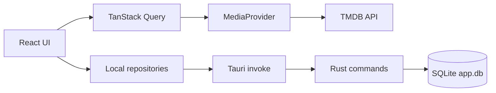

# CineTrack architecture

This document is the detailed, code-grounded companion to the architecture summary in `CLAUDE.md`. Read `docs/design-system.md` for UI/token rules and `docs/auth.md` for the Supabase sign-in setup — this document covers how data flows through the app and how a domain is structured end to end.

## Two data worlds, kept separate

CineTrack has exactly one network dependency (TMDB) and one persistence layer (SQLite), and the two are never mixed:



- **Catalogue data** (titles, images, cast, availability) comes from TMDB through `MediaProvider` (`src/features/media/media-provider.ts`, implemented by `tmdb-media-provider.ts`), fetched with TanStack Query. Nothing else in the app talks to the network.
- **Personal data** (watchlist, library, progress, history, profiles, preferences, custom lists, availability alerts) lives in local SQLite (`sqlite:app.db`), reachable only from inside the Tauri webview — a plain browser tab has no IPC bridge, even pointed at the same dev server.

Outside the Tauri window (`pnpm dev` alone, or a browser tab), the UI still renders — no hook uses React Query's suspense mode — but every SQLite read/write fails silently; `browser-preview-banner.tsx` flags this. That failure mode is intentional, not a bug to chase.

## The feature shape

Every domain under `src/features/<domain>/` follows the same four layers. Reading them bottom-up, using `watchlist` as the running example:

### 1. Rust command layer — `src-tauri/src/commands/watchlist.rs`

Owns the SQL, transactions, cascades, and active-profile resolution. A command is a thin `#[tauri::command]` wrapper around an `_impl` function that does the real work against a `SqlitePool`:

```rust
#[tauri::command]
pub async fn save_watchlist_item(item: WatchlistItem, pool: State<'_, SqlitePool>) -> Result<(), ApiError> {
    upsert_impl(&pool, item).await
}
```

`current_profile_id(pool)` (`src-tauri/src/database/mod.rs`) resolves which local profile a read/write applies to by reading the `activeProfileId` preference, defaulting to `"default"`. Commands that mutate more than one table wrap the work in `pool.begin()` / `tx.commit()` (see `watchlist.rs`, `progress.rs`, `backup.rs`, `tvtime.rs`, `profiles.rs`) so a failure partway through doesn't leave orphaned rows — a real bug of exactly this shape (a list-deletion command running two unwrapped `DELETE`s) was fixed in `custom_lists.rs::remove_impl`, which is now the pattern every new multi-statement command should copy.

Every command returns `Result<T, ApiError>` (`src-tauri/src/error.rs`), a small serializable struct:

```rust
#[derive(Debug, Serialize)]
#[serde(rename_all = "camelCase")]
pub struct ApiError {
    pub message: String,
    pub status: Option<u16>,
}
```

`status` mirrors an HTTP status code (`ApiError::not_found`, `::conflict`, `::bad_request`, `::internal`) so the same shape could back a real HTTP API later without changing any frontend caller.

### 2. TS repository — `src/features/watchlist/watchlist-repository.ts`

A thin `invokeCommand()` wrapper, deliberately without business logic:

```ts
export const watchlistRepository = {
  async save(item: WatchlistItem): Promise<void> {
    await invokeCommand<void>("save_watchlist_item", { item });
  },
  // list, has, remove follow the same shape
};
```

`invokeCommand()` (`src/shared/lib/invoke.ts`) normalizes every Rust failure into `ApiCommandError { message, status }` — the exact mirror of Rust's `ApiError`. Don't catch and re-stringify IPC errors anywhere else; let this shape flow up to a remote-error state.

Two repositories intentionally break the "thin wrapper" rule and say so in a comment: `stats-repository.ts` (aggregation/streak/forecast math done in TS rather than SQL) and `progress-repository.ts` (orchestrates two IPC calls plus a history write from the client). Both are documented, deliberate exceptions — not a pattern to copy without the same justification.

### 3. Hook — `src/features/watchlist/use-watchlist.ts`

Wraps the repository in TanStack Query: `useQuery` for reads, and `useInvalidatingMutation` (`src/shared/lib/query-mutation.ts`) for writes — a small helper that fires a mutation and then invalidates a fixed (or result-derived) list of query keys:

```ts
const remove = useInvalidatingMutation(
  ({ mediaId, mediaType }: { mediaId: number; mediaType: WatchlistItem["mediaType"] }) =>
    watchlistRepository.remove(mediaId, mediaType),
  [queryKeys.local.watchlist, queryKeys.local.history]
);
```

`queryKeys.local.history` is invalidated by most local mutations because most of them also write an activity-log entry server-side. `useInvalidatingMutation` isn't a fit for every hook — `useLibraryItem`, `useAvailabilityAlert`, and `usePreferences` also call `setQueryData` with the mutation's result or branch on which field changed, so they stay as plain `useMutation` rather than bending the helper to cover every shape (see the comment in `query-mutation.ts`).

All query keys live in one registry, `src/shared/constants/query-keys.ts`, split into `remote.*` (TMDB) and `local.*` (SQLite) namespaces. That namespace split is also what lets the query-cache persister (`src/main.tsx`) only persist `local.*` to `localStorage`, leaving unbounded `remote.*` results (discover/search/images) as in-memory-only cache.

### 4. Page — `src/pages/watchlist-page.tsx`

Composes hooks; pages never call a repository directly. A page reading remote or local data needs an explicit `RemoteErrorState` (`src/components/states/remote-error-state.tsx`) rather than a silent hang — this is a repeated review finding in the project's own history (`git log --grep=remote-error`) and is treated as a non-negotiable, not a nice-to-have.

## State management split

- **Server/persisted state** (anything that comes from TMDB or SQLite) lives in TanStack Query, never duplicated into a store.
- **Pure UI state** (e.g. whether the mobile nav is open) lives in Zustand (`src/store/`). It's intentionally tiny — if you're tempted to put fetched data in a Zustand store, it almost certainly belongs in a query instead.

## Testing strategy

- **Rust** (`cargo test`) exercises the command layer directly against a real, migrated SQLite pool (`migrated_pool()` test helper) — this is where cascades, transactions, and multi-table invariants are proven, not just "does the call succeed."
- **TS repositories** are tested either against a fake `invoke()` backend (`src/db/__tests__/fake-invoke-backend.ts`, for invoke-plumbing behavior) or a real SQLite engine (`sqlite-adapter.ts` / `sqlite-test-harness.ts`, for SQL behavior like joins and cascades) — prefer the real engine when the thing under test is actually about SQL.
- `vitest.config.ts` pins coverage thresholds **per file**, not globally — most UI has no tests yet, which is a known, tracked gap rather than a silent regression. If you give a listed file real tests, move its threshold up with it; don't leave it stale.
- There is currently no end-to-end test suite (no Playwright/Cypress) — only unit/component tests plus `cargo test`.

## Adding a new domain

Extending the app with a 16th feature domain touches a small, fixed set of places — the cost is linear, not something that multiplies as the app grows:

1. `src-tauri/src/commands/<domain>.rs` — commands + `_impl` functions, registered in the `tauri::generate_handler![...]` list in `src-tauri/src/lib.rs`.
2. `src/features/<domain>/<domain>-repository.ts` — thin `invokeCommand()` wrapper.
3. `src/features/<domain>/use-<domain>.ts` — `useQuery`/`useInvalidatingMutation` hook.
4. A new `local.<domain>` entry in `src/shared/constants/query-keys.ts`.
5. New keys in **both** `src/i18n/locales/en.json` and `src/i18n/locales/fr.json` — `locale-parity.test.ts` fails the build otherwise.

There's no per-domain boilerplate beyond that — no generated code, no domain registry to update elsewhere.
