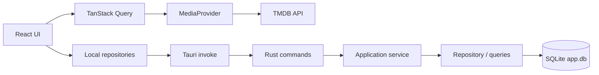

# CineTrack architecture

This document is the detailed, code-grounded companion to the architecture summary in `CLAUDE.md`. Read `docs/design-system.md` for UI/token rules and `docs/auth.md` for the Supabase sign-in setup — this document covers how data flows through the app and how a domain is structured end to end.

## Two data worlds, kept separate

CineTrack has exactly one network dependency (TMDB) and one persistence layer (SQLite), and the two are never mixed:



- **Catalogue data** (titles, images, cast, availability) comes from TMDB through `MediaProvider` (`src/features/media/media-provider.ts`, implemented by `tmdb-media-provider.ts`), fetched with TanStack Query. Nothing else in the app talks to the network.
- **Personal data** (library, progress, history, profiles, preferences, custom lists, availability alerts) lives in local SQLite (`sqlite:app.db`), reachable only from inside the Tauri webview — a plain browser tab has no IPC bridge, even pointed at the same dev server.

Outside the Tauri window (`pnpm dev` alone, or a browser tab), the UI still renders — no hook uses React Query's suspense mode — but every SQLite read/write fails silently; `browser-preview-banner.tsx` flags this. That failure mode is intentional, not a bug to chase.

## The feature shape

Frontend domains live under `src/features/<domain>/`. Core backend domains that own substantial business or persistence logic live as crate-root vertical slices under `src-tauri/src/<domain>/`; `src-tauri/src/commands/mod.rs` remains the Tauri IPC registry. Reading the Library flow bottom-up:

### 1. Rust domain slice — `src-tauri/src/library/`

`commands.rs` is a thin `#[tauri::command]` adapter. `service.rs` resolves the active profile and orchestrates the use case, while `repository.rs` and `queries.rs` own SQL, transactions, cascades, and persistence details:

```rust
#[tauri::command]
pub async fn save_library_item(
    media: MediaSummaryInput,
    patch: Option<LibraryPatch>,
    pool: State<'_, SqlitePool>,
) -> Result<LibraryItem, ApiError> {
    LibraryService::new(pool.inner()).save(media, patch).await
}
```

`current_profile_id(pool)` (`src-tauri/src/database/mod.rs`) resolves which local profile a read/write applies to by reading the `activeProfileId` preference, defaulting to `"default"`; the crate-root services call it rather than duplicating profile selection in each Tauri adapter. Multi-table mutations keep their transaction in the persistence boundary (see `src-tauri/src/library/repository.rs`, `src-tauri/src/progress/repository.rs`, `src-tauri/src/backup/repository.rs`, and `src-tauri/src/integrations/tvtime/importer.rs`) so a failure partway through cannot leave orphaned rows. `library/repository.rs::upsert_impl` also shows the idempotent-mutation pattern from `CLAUDE.md`: it appends a history entry only when an item is first created, never on a plain status/rating update.

Every command returns `Result<T, ApiError>` (`src-tauri/src/error.rs`), a small serializable struct:

```rust
#[derive(Debug, Serialize)]
#[serde(rename_all = "camelCase")]
pub struct ApiError {
    pub message: String,
    pub status: Option<u16>,
}
```

`status` mirrors an HTTP status code (`ApiError::not_found`, `::conflict`, `::bad_request`, `::internal`) so the same shape could back a real HTTP API later without changing any frontend caller.

**Local timing, no remote telemetry.** Every command's body is wrapped in `src-tauri/src/diagnostics.rs`'s `timed("command_name", async { ... }).await`, which logs `layer=backend command=<name> duration=<ms>ms` (or `slow_command=` at warn level past a threshold, `status=error` appended on failure) to the same `logs/cinetrack.log` file the frontend's own `invokeCommand()` writes to (see `src/shared/lib/invoke.ts`), which logs the same shape tagged `layer=frontend` instead — the two interleave by timestamp when read together, and Settings' diagnostics view (raw tail + a structured `export_diagnostics_summary` aggregate) shows both without knowing which side produced which line. The `layer=` tag exists because the frontend's line measures the full round trip (IPC serialization + the entire Rust command/service/SQL chain) while the backend's line measures only this function's own execution — two different measurements that, before this tag existed, both wrote the identical `command=<name> duration=<ms>ms` shape and so silently averaged together under one bucket per command name in `export_diagnostics_summary`'s aggregate; `summarize` groups by `(layer, command)`, not `command` alone, and a pre-existing log line with no `layer=` marker at all still summarizes under its own `unknown` bucket rather than being dropped or merged in. `timed` reads a process-wide `OnceLock<PathBuf>` set once from `.setup()` rather than taking an `AppHandle` parameter — every command-level test in this crate (`tauri::test::mock_app()`-based) calls its command directly by name, so threading a parameter through every signature would have meant updating all of them; the static stays unset under `cargo test`, making logging a silent no-op there instead. This is intentionally not a distributed trace ID: Tauri's IPC has no generic channel to thread one through every command without a much bigger change, so layer + command name + roughly-simultaneous timestamps are the practical correlation between the frontend and backend's log lines.

**What's generated vs. hand-written across the IPC boundary.** IPC result DTOs and enums that have a 1:1 TypeScript mirror derive `ts_rs::TS` with `#[ts(export)]`. `cargo test` (via `pnpm contract:generate-ts-bindings`) writes their real TypeScript shape into `src/generated/dto/`, which `src/types/media.ts` re-exports. `pnpm contract:check-ts-bindings` (part of `pnpm validate:backend`, and of the Linux Rust CI job) regenerates those files and fails if `src/generated/dto` drifts from what the Rust types currently produce — so a renamed field, a changed enum variant, or a nested `Option<T>`/`Vec<T>` no longer matching across the boundary is a build failure, not a review finding. `TS_RS_EXPORT_DIR` and `TS_RS_LARGE_INT=number` live in the repo-root `.cargo/config.toml` (see that file's comment for why it isn't under `src-tauri/`). Two DTOs are deliberately _not_ generated: `SmartList.rules` and `SavedFilter.filters` are opaque `serde_json::Value` in Rust (nothing in Rust inspects their fields) while their TS mirrors are intentionally more precise — `scripts/check-contract-drift.mjs` still compares field-_name_ sets for those two. `profiles::models::UserProfile` is also kept hand-written in `src/types/media.ts`: it shares a frontend name with the nested preferences profile (`src/generated/dto/UserProfile.ts`) and the hand-written type is a loose superset covering both. Catalogue types (`Movie`, `Series`, `MediaSummary`, …) never cross IPC from Rust; they stay hand-written. `pnpm contract:check` (part of `pnpm validate:frontend`) still runs three other checks. `scripts/generate-tauri-command-names.mjs --check` diffs `src/generated/tauri-command-names.ts` against `tauri::generate_handler![...]` in `src-tauri/src/lib.rs`, so a command typo or a command registered in Rust but never wired into a TS `defineCommand(...)` call fails the build. `scripts/check-contract-drift.mjs` covers the two opaque DTOs above. `scripts/check-tauri-command-signatures.mjs` compares each registered command's Rust parameters (name, optionality, and a coarse shape category — string/number/boolean/void/array, with `named` as the catch-all for structs/enums) against the matching TS `defineCommand(...)` `Args`/`Result` descriptor, so an added/removed/renamed parameter, or one that's optional on only one side, fails the build too. The signature checker's shape categories remain coarse by design for _command arguments_ that are not themselves exported DTOs (`LibraryPatch`, `MediaSummaryInput`, …): a `named` shape paired with any other category still passes silently. Add `#[derive(ts_rs::TS)] #[ts(export)]` to a new IPC DTO rather than extending `PAIRS`, unless the Rust side is intentionally opaque JSON.

### 2. TS repository — `src/features/library/library-repository.ts`

A thin `invokeCommand()` wrapper, deliberately without business logic:

```ts
export const libraryRepository = {
  async save(media: MediaSummary, patch: LibraryPatch = {}): Promise<LibraryItem> {
    return invokeCommand<LibraryItem>("save_library_item", { media, patch });
  },
  // list, get, has, remove, removeIfPlanned follow the same shape
};
```

`invokeCommand()` (`src/shared/lib/invoke.ts`) normalizes every Rust failure into `ApiCommandError { message, status }` — the exact mirror of Rust's `ApiError`. Don't catch and re-stringify IPC errors anywhere else; let this shape flow up to a remote-error state.

Two repositories intentionally break the "thin wrapper" rule and say so in a comment: `stats-repository.ts` (aggregation/streak/forecast math done in TS rather than SQL) and `profile-repository.ts` (its `remove()` makes a follow-up `invoke()` call to reset `activeProfileId` when the removed profile was the active one). Both are documented, deliberate exceptions — not a pattern to copy without the same justification. `progress-repository.ts` used to be a third exception (it orchestrated two IPC calls plus a client-side history write) until history logging moved into the same Rust transaction as the toggle itself — it's a plain thin wrapper now.

### 3. Hook — `src/features/library/use-library.ts`

Wraps the repository in TanStack Query: `useQuery` for reads, and `useInvalidatingMutation` (`src/shared/lib/query-mutation.ts`) for writes — a small helper that fires a mutation and then invalidates a fixed (or result-derived) list of query keys:

```ts
const removeIfPlanned = useInvalidatingMutation(
  ({ mediaId, mediaType }: { mediaId: number; mediaType: MediaSummary["mediaType"] }) =>
    libraryRepository.removeIfPlanned(mediaId, mediaType),
  [queryKeys.local.library(profileId), queryKeys.local.history(profileId)]
);
```

`useLibraryQuickToggle` (the grid/detail-page "add to library" toggle behind `AddToLibraryButton`/`AddToLibraryQuickAction`) pairs this with a guarded remove: it only deletes an item still in the default `planned` status, leaving anything with real progress (`watching`, `completed`, ...) untouched — see `remove_if_planned_impl` in the Rust layer above.

`queryKeys.local.history` is invalidated by most local mutations because most of them also write an activity-log entry server-side. `useInvalidatingMutation` isn't a fit for every hook — `useLibraryItem`, `useAvailabilityAlert`, and `usePreferences` also call `setQueryData` with the mutation's result or branch on which field changed, so they stay as plain `useMutation` rather than bending the helper to cover every shape (see the comment in `query-mutation.ts`).

All query keys live in one registry, `src/shared/constants/query-keys.ts`, split into `remote.*` (TMDB) and `local.*` (SQLite) namespaces — that split is also the privacy boundary for persistence. `local.*` results used to be persisted to `localStorage` for a fast cold start, but that duplicated personal data in a second, less-protected storage location the webview's own JavaScript can read, so that persister was removed and `local.*` is memory-only, for the process's lifetime, same as before (`src/app/query-client.ts`, see the comment there). `remote.*` (TMDB catalogue data — public, non-sensitive) has no such concern, so it's persisted to `localStorage` under `cinetrack.remote-cache.v1`, capped at 24h, for an instant cold start; `shouldDehydrateQuery` (same file) is the hard boundary enforcing that only `remote.*` ever gets written there. `src/main.tsx` separately clears the old `cinetrack.query-cache.v1` key — a leftover from before the persister was split into today's remote-only shape, distinct from the current `cinetrack.remote-cache.v1` key.

### 4. Page — `src/pages/library-page.tsx`

Composes hooks; pages never call a repository directly. A page reading remote or local data needs an explicit `RemoteErrorState` (`src/components/states/remote-error-state.tsx`) rather than a silent hang — this is a repeated review finding in the project's own history (`git log --grep=remote-error`) and is treated as a non-negotiable, not a nice-to-have.

## Startup and database recovery

`init_pool_at` (`src-tauri/src/database/mod.rs`) doesn't let a broken database take the whole app down, but it distinguishes two failure shapes rather than treating every startup failure the same way. If a specific migration statement fails (`migrations::apply_pending_migrations`), the file is almost certainly fine — every earlier migration already committed in its own transaction — so it's left completely untouched and boot reports back as `blocked` (no quarantine, no silent "continue anyway": the frontend's `BootRecoveryGate` must not offer to skip this one, since the fix is an app update, not discarding data). Only when the migrations all report success but `migrations::verify_critical_tables` still can't find the tables it expects — corruption, or an incomplete manual restore, with no earlier valid state in this file to fall back to — does it quarantine the file (renames it aside, never deletes it) and open a fresh one instead. A _second_ failure on that fresh file (disk full, permissions) still has no database-level recovery, but it no longer crashes silently either: `src-tauri/src/lib.rs` shows a native OS dialog (`rfd` crate) explaining the data isn't lost, then exits cleanly via `std::process::exit(1)` — desktop-only (`#[cfg(desktop)]`; mobile keeps the old panic, since `rfd` has no mobile backend). See `docs/audit-findings.md`'s "Startup database failures must degrade, not crash" entry for why this shape and not a full second recovery path.

The frontend surfaces this: `get_boot_recovery` (`src/features/desktop/boot-recovery-repository.ts`) reports whether a quarantine just happened, and `use-boot-recovery.ts` / `BootRecoveryGate` block the rest of the app behind a recovery screen (offering to restore the last automatic backup, or continue with a fresh database) until the user picks one. See `boot-recovery-gate.test.tsx` for the covered scenarios.

## State management split

- **Server/persisted state** (anything that comes from TMDB or SQLite) lives in TanStack Query, never duplicated into a store.
- **Pure UI state** (e.g. whether the mobile nav is open) lives in Zustand (`src/store/`). It's intentionally tiny — if you're tempted to put fetched data in a Zustand store, it almost certainly belongs in a query instead.

## Testing strategy

- **Rust** (`cargo test`) exercises the crate-root domain slices directly against real, migrated SQLite pools — this is where service orchestration, cascades, transactions, query behavior, and multi-table invariants are proven, not just "does the call succeed."
- **TS repositories** mock `invoke()`/`invokeTypedCommand` directly and assert the right command name/args plus result passthrough (see `library-repository.test.ts`) — the SQL, transactions, and cascades a command triggers are Rust's job, tested there via `cargo test`, not reproduced a second time in TS against a fake reimplementation (a real prior bug class: the TS fake and the Rust command drifting apart while both test suites stayed green). The one place TS still drives a real SQLite engine is `sqlite-adapter.ts`, used directly by the migration/recovery tests (`src/db/__tests__/migrations*.test.ts`) for schema/cascade behavior that's genuinely TS-side.
- `vitest.config.ts` pins coverage thresholds **per file**, not globally — most UI has no tests yet, which is a known, tracked gap rather than a silent regression. If you give a listed file real tests, move its threshold up with it; don't leave it stale.
- There is currently no _functional_ end-to-end test suite (no Cypress, no Tauri-driven Playwright) — only unit/component tests plus `cargo test` exercise real user flows. `e2e/visual/` does run Playwright, but only against `pnpm dev`'s browser-preview shell for layout/responsive/theme screenshots (see its own README) — it never drives the real Tauri window or touches SQLite, so it doesn't close this gap.

## Architecture boundaries

These are normative rules, not just a description of the current shape — a change that violates one of them should be treated as a bug in the change, not a precedent.

**Rust — dependency direction within a domain slice:**

```
commands  →  service  →  repository / queries
                              ↓
                           domain
```

- `repository.rs` / `queries.rs` must never import from `commands.rs`, and must never `use tauri` outside a `#[cfg(test)]` block (the embedded command-wrapper tests are the one legitimate exception — see e.g. `library/repository.rs`'s test module). A repository that needs Tauri types has leaked an IPC concern into the persistence layer.
- `domain.rs` (pure business rules — status transitions, ranking, validation) must never import `tauri` or `sqlx` at all. If a "domain" function needs a database connection, it isn't domain logic; it belongs in `repository.rs`.
- Cross-domain calls go through a narrow, explicitly `pub(crate)`-exported function from the target domain's `mod.rs` (e.g. `history::add_history_item_impl`, `profiles::get_by_id_impl`), never by reaching into another domain's `repository.rs` or `service.rs` module path directly.

This is enforced by the compiler, not just reviewed by convention: every `repository`/`queries`/`domain` function is `pub(super)` (visible only within its own domain module tree) unless a cross-domain caller specifically needs it, in which case it's `pub(crate)` and re-exported from that domain's `mod.rs`. A `pub(super)` function is not just discouraged from being called from another domain — Rust refuses to compile the call. `cargo check` is the boundary check here; there's no separate lint to run.

**Frontend — dependency direction:**

```
pages
  ↓
features / product-pattern components (components/media, components/states, ...)
  ↓
components/ui, shared/
```

- `src/shared/**` and `src/components/ui/**` are the lowest layer: every feature and page may depend on them, but they must never import from `src/features/**` or `src/pages/**`. `src/shared/**` is generic app plumbing (query-keys, invoke wrapper, constants); `src/components/ui/**` is Alba-token primitives with zero business-domain awareness — see `CLAUDE.md`'s design-system section for the ui/product-component distinction.
- `src/pages/**` compose features and components; nothing outside `src/pages/**` should import a page.
- A feature may depend on another feature — and a page or component may depend on any feature — only through that feature's public surface: `*-repository.ts`, `use-*.ts`, or a curated `index.ts`. Command descriptors, services, API adapters, evaluators and other helpers stay private to their owning feature.
- The feature dependency graph must remain acyclic. If two features need each other, move the shared abstraction down to `src/shared/**` (when genuinely domain-neutral) or introduce a higher-level composition layer instead of creating a cycle.

`eslint.config.js`'s `boundaries/dependencies` rule (via `eslint-plugin-boundaries`) enforces the `shared ↛ features/pages` and `components/ui ↛ features/pages` rules as build-breaking errors — `pnpm lint` is the check. The public-surface rule itself — both feature-to-feature and components/pages-to-feature — **is** enforced, separately: `pnpm architecture:check` (`scripts/check-feature-boundaries.mjs`, part of `pnpm validate:frontend`) walks the TS program and fails the build if a feature, page, or component imports a feature's file other than its public surface (`*-repository.ts`, `use-*.ts`, or `index.ts`) — see rule 3 above. `eslint-plugin-boundaries` can't express this rule itself (it matches directory patterns, not "only these specific filenames within the target directory"), which is why a dedicated script exists rather than another `boundaries/dependencies` policy. Every `src/features/*/` directory has its own `__tests__/` subdirectory (as do the `src/components/**/__tests__/` and `src/pages/__tests__/` directories this check also walks, both excluded from it the same way); some feature directories (e.g. `media/`) additionally have their own internal subdirectories (`api/`), which this check treats as private.

## Adding a new domain

Extending the app with a new feature domain touches a small, fixed set of places — the cost is linear, not something that multiplies as the app grows:

1. For a substantial backend domain, add `src-tauri/src/<domain>/` with a thin `commands.rs`, application `service.rs`, and focused repository/query modules; register the root module in `src-tauri/src/lib.rs` and re-export its Tauri commands from `src-tauri/src/commands/mod.rs` so the existing `tauri::generate_handler![...]` registry remains the IPC facade.
2. `src/features/<domain>/<domain>-repository.ts` — thin `invokeCommand()` wrapper.
3. `src/features/<domain>/use-<domain>.ts` — `useQuery`/`useInvalidatingMutation` hook.
4. A new `local.<domain>` entry in `src/shared/constants/query-keys.ts`.
5. New keys in **both** `src/i18n/locales/en.json` and `src/i18n/locales/fr.json` — `locale-parity.test.ts` fails the build otherwise.

There's no per-domain boilerplate beyond that — no domain registry to update elsewhere. A new IPC result DTO should derive `ts_rs::TS` with `#[ts(export)]` so `src/generated/dto/` stays the TypeScript source of truth (see the IPC boundary section above); catalogue types that never leave the frontend stay hand-written in `src/types/media.ts`.

`src/features/tvtime/` is the one domain that deliberately skips steps 3 and 4: it's a one-shot import flow with no state of its own to query, so it has no `use-tvtime.ts` hook and no dedicated `local.tvtime` query key — the importing component invalidates the local query cache directly instead. Don't take it as the template for a domain that actually persists and reads its own state.
