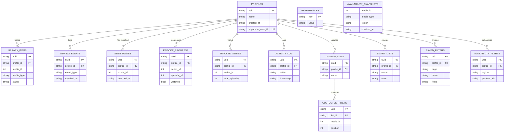

# CineTrack — database schema

The database is local SQLite, embedded in the app via Tauri — no server, everything lives on the machine. It's designed to be **multi-profile** from the start: almost every table carries a `profile_id` that isolates one profile's data from the others, with `FOREIGN KEY … ON DELETE CASCADE` constraints guaranteeing no row survives the deletion of its profile or its list. A profile is only _optionally_ linked to a Supabase account: fully offline (the default, `VITE_AUTH_REQUIRED=false`), a user can create, switch between, and remove as many local-only profiles as they want with no account involved at all (`src/pages/settings-page.tsx` — the standalone Collections page was retired into Library and Settings). Linking only comes into play once Supabase sign-in is required — see below.

Every table's primary key is a `uuid TEXT PRIMARY KEY`, generated app-side in Rust (`new_uuid()`, a UUIDv7, in [`src-tauri/src/database/mod.rs`](../src-tauri/src/database/mod.rs)) — there is no separate internal integer id. Two tables deliberately don't follow this: `preferences` (`key` is already a stable natural primary key) and `availability_snapshots` (a pure cache keyed by `(media_id, media_type, region)`, with no row ever referenced individually).

**14 active tables · 10 migrations · 1 database file per machine.**

The canonical DDL is SQL, under [`src-tauri/src/database/migrations/`](../src-tauri/src/database/migrations/) — `001-initial-schema.sql` plus nine follow-ups: `009-availability-alerts-unique.sql`, `010-merge-watchlist-into-library.sql`, `011-add-status-to-tracked-series.sql`, `012-remove-rewatching-status.sql`, `013-add-note-to-viewing-events.sql`, `014-add-smart-lists.sql`, `015-add-saved-filters.sql`, `016-index-large-library-stats.sql`, `017-library-cursor-pagination-indexes.sql` (versions jump from 1 to 9 because an earlier 8-step pre-launch sequence was squashed into version 1 — see the comment in `src/db/migrations/index.ts`). The frontend imports these same files via `src/db/migrations/index.ts`/`canonical.ts` — there's no separate hand-written TS migration set to drift from the Rust side. This document is a readable companion to those files, not a replacement for them.

## Profiles & preferences

The foundation for everything else: each profile has its own library, history, and lists. Preferences, on the other hand, deliberately do **not** follow this split.

### `profiles`

A profile = a person using the app. **Every** table below attaches to it via `profile_id` (which points to `profiles.uuid`). The `'default'` profile is created automatically by the migration and can never be deleted. Fully offline, profiles are unlinked and freely switchable — see above. Once Supabase sign-in is required, a profile must be **linked to a Supabase account** to be accessible: the first account that signs in automatically claims `'default'` (and its existing data), any following account must create its own profile. This is enforced by the Rust command layer itself, not just the app's `ProfileGate` (`src/features/auth/profile-gate.tsx`): `set_active_profile` (`src-tauri/src/preferences/service.rs`) checks the target profile's `supabase_user_id` against the caller-supplied id before switching, and `update_preference` refuses to change `activeProfileId` through any other path. This isn't cryptographic verification of that id (it's an unsigned string over the same `invoke()` boundary as everything else), but it closes the gap where switching used to be a bare, unchecked preference write — see the "Authorization belongs in the Rust command" rule in `CLAUDE.md`.

| Column                     | Type | Notes                                                                                                                          |
| -------------------------- | ---- | ------------------------------------------------------------------------------------------------------------------------------ |
| `uuid` **PK**              | TEXT | `'default'` or a generated UUID — this is what the app calls `.id`                                                             |
| `name`                     | TEXT | displayed name                                                                                                                 |
| `avatar`                   | TEXT | optional                                                                                                                       |
| `supabase_user_id` **UK**  | TEXT | optional, unique — id of the linked Supabase account; no FK possible, `auth.users` lives on Supabase, outside this SQLite file |
| `created_at`, `updated_at` | TEXT | ISO dates                                                                                                                      |

Relations: a profile has `0..n` rows in every table below. No dedicated index (the table is tiny and always scanned by `uuid`).

### `preferences`

Application settings: theme, accent color, language, TMDB region, spoiler protection, notifications, and `activeProfileId` — the currently selected profile. This is a **global** table, shared by every profile: they share the same app, not the same per-profile preferences.

| Column       | Type | Notes                           |
| ------------ | ---- | ------------------------------- |
| `key` **PK** | TEXT | e.g. `theme`, `activeProfileId` |
| `value`      | TEXT | value encoded as JSON           |
| `updated_at` | TEXT | ISO date                        |

No declared relation — table intentionally independent from profiles. No `uuid`: `key` is already a stable natural key, and nothing references an individual preference row.

## Library & progress

The functional core of the app. Three ideas deliberately coexist: a current _state_ (`library_items`, `status`), an immutable _event log_ (`viewing_events`, used for statistics), and lighter tables that are faster to query for day-to-day interactive use (seen/unseen, episode progress, tracked shows).

### `library_items`

The full record of a movie or show in a profile's library: its **status** (`planned`, `watching`, `paused`, `completed`, `dropped`), the personal rating, free-form notes, tags, start/end dates, and the rewatch count.

| Column                                        | Type      | Notes                                                                   |
| --------------------------------------------- | --------- | ----------------------------------------------------------------------- |
| `uuid` **PK**                                 | TEXT      | public identifier of the row                                            |
| `profile_id` `FK`                             | TEXT      | → `profiles.uuid`                                                       |
| `media_id`, `media_type` **UK**               | INT, TEXT | TMDB id + `movie`/`series` — `UNIQUE(profile_id, media_id, media_type)` |
| `title`, `poster_path`, `backdrop_path`       | TEXT      | TMDB copy taken when added                                              |
| `year`, `rating`                              | INT, REAL | TMDB copy (`year > 1800`, `rating` 0–10)                                |
| `genres`                                      | TEXT      | JSON array, copied from TMDB                                            |
| `status`                                      | TEXT      | defaults to `planned`                                                   |
| `favourite`, `user_rating`, `notes`, `tags`   | …         | `user_rating` 1–10, `tags` as JSON                                      |
| `started_at`, `completed_at`, `rewatch_count` | …         | set based on status changes                                             |
| `created_at`, `updated_at`                    | TEXT      | ISO dates                                                               |

Indexes: `(profile_id, status, updated_at DESC)`, `(media_id, media_type)`, plus two added by migration 16 for large-library stats queries: `(profile_id, media_type, status, completed_at ASC)` and a partial index `(profile_id, user_rating) WHERE user_rating IS NOT NULL`. Migration 17 replaced the plain `(profile_id, updated_at DESC)` index with `(profile_id, updated_at DESC, media_id DESC, media_type DESC)` — matching the tiebreak order the Library listing query already sorts by — and added two more for the Library page's cursor-paginated grid/list: `(profile_id, title ASC, media_id ASC, media_type ASC)` and `(profile_id, COALESCE(user_rating, rating, -1.0) DESC, media_id DESC, media_type DESC)`, one per sort mode `list_library_page` supports (see `src-tauri/src/library/queries.rs`'s `list_page_impl`).

Relations: a profile owns `0..n` library entries. Deleting the profile deletes the row (`ON DELETE CASCADE`). Updates go through `INSERT … ON CONFLICT DO UPDATE` rather than `INSERT OR REPLACE`, so `uuid`/`created_at` survive a status change.

`library_items` also covers what used to be a separate `watchlist_items` table, folded in by migration 10 (`src-tauri/src/database/migrations.rs`): a `planned` status row is the "to watch" equivalent — adding a title to the library defaults it to `planned` rather than writing to a second table. The migration is one-way and non-destructive: an existing `watchlist_items` row becomes a new `planned` library row unless a library row already exists for the same `(profile_id, media_id, media_type)`, in which case the library row wins and the watchlist row is dropped.

### `viewing_events`

Every watch (or un-watch) generates a row here: a whole movie or a specific episode, with its duration. This is **this** table — not `library_items.status` — that feeds the statistics (minutes watched, consecutive-day streaks, monthly activity).

| Column                                          | Type      | Notes                                                                                   |
| ----------------------------------------------- | --------- | --------------------------------------------------------------------------------------- |
| `uuid` **PK**                                   | TEXT      | public identifier of the row                                                            |
| `profile_id` `FK`                               | TEXT      | → `profiles.uuid`                                                                       |
| `media_id`, `media_type`, `title`               | …         | which title the event is about                                                          |
| `event_type`                                    | TEXT      | `watched` / `unwatched` / `rewatched`                                                   |
| `watched_at`, `duration_minutes`                | TEXT, INT | timestamp + duration for stats                                                          |
| `episode_id`, `season_number`, `episode_number` | INT       | null for a movie                                                                        |
| `note`                                          | TEXT      | optional free-form note on the event, nullable (added by migration 13)                  |
| `created_at`                                    | TEXT      | ISO date; no `updated_at` — **append-only** log, no row is ever modified after the fact |

Indexes: `(profile_id, watched_at DESC)`, `(media_id, media_type)`, plus two added by migration 16 for large-library stats queries: `(profile_id, media_id, media_type, episode_id, watched_at DESC, created_at DESC)` and `(profile_id, media_id, media_type, watched_at DESC)`.

Relations: a profile logs `0..n` events.

### `seen_movies`

A simple "seen" toggle for movies, faster than going through the full library. Used to be called `profile_seen_movies` before the single schema.

| Column                                  | Type | Notes                                              |
| --------------------------------------- | ---- | -------------------------------------------------- |
| `uuid` **PK**                           | TEXT | public identifier of the row                       |
| `profile_id`, `movie_id` `FK` **UK**    | …    | → `profiles.uuid` ; `UNIQUE(profile_id, movie_id)` |
| `title`, `poster_path`, `backdrop_path` | TEXT | TMDB copy taken when added                         |
| `watched_at`                            | TEXT | watch date (can predate the import, e.g. TV Time)  |
| `created_at`, `updated_at`              | TEXT | ISO dates — row insertion vs. last modification    |

Indexes: `(profile_id, watched_at DESC)`, `(movie_id)`.

Relations: a profile has `0..n` movies marked as seen.

### `episode_progress`

One row per watched episode. This is the source of truth for where a profile stands in a show — the displayed count is recomputed on read, not stored. Used to be called `profile_episode_progress` before the single schema.

| Column                                              | Type       | Notes                                     |
| --------------------------------------------------- | ---------- | ----------------------------------------- |
| `uuid` **PK**                                       | TEXT       | public identifier of the row              |
| `profile_id`, `series_id`, `episode_id` `FK` **UK** | …          | → `profiles.uuid` ; natural composite key |
| `season_number`, `episode_number`                   | INT        | locates the episode (both `>= 0`)         |
| `watched`, `watched_at`                             | BOOL, TEXT | defaults to watched                       |
| `created_at`, `updated_at`                          | TEXT       | ISO dates                                 |

Indexes: `(profile_id, series_id, watched)`, `(episode_id)`.

Relations: a profile has `0..n` episodes marked as watched.

### `tracked_series`

One row per show a profile actively tracks. The number of watched episodes is **not** stored here: it's computed via a join with `episode_progress` on every read, so a counter can never drift out of sync. Used to be called `profile_tracked_series` before the single schema.

| Column                                  | Type | Notes                                                                                                                                            |
| --------------------------------------- | ---- | ------------------------------------------------------------------------------------------------------------------------------------------------ |
| `uuid` **PK**                           | TEXT | public identifier of the row                                                                                                                     |
| `profile_id`, `series_id` `FK` **UK**   | …    | → `profiles.uuid` ; natural composite key                                                                                                        |
| `title`, `poster_path`, `backdrop_path` | TEXT | TMDB copy taken when added                                                                                                                       |
| `total_episodes`                        | INT  | total known from TMDB, defaults to 0                                                                                                             |
| `status`                                | TEXT | TMDB production status ("Returning Series", "Ended", …), nullable — unknown for rows written before this column existed or imported from TV Time |
| `created_at`, `updated_at`              | TEXT | ISO dates                                                                                                                                        |

Indexes: `(profile_id, updated_at DESC)`, `(series_id)`.

Relations: a profile tracks `0..n` shows.

## Activity history

The activity feed shown on the "History" screen — human-readable, distinct from the statistical log above even though the two are often written at the same time.

### `activity_log`

Every notable action — adding to a list, a movie marked watched, an episode or a whole season checked off — becomes a row here with an `action` from 13 possible values (`movie:watched`, `watchlist:add`, `list:remove`, …) and a `metadata` JSON field for details specific to each action.

| Column                                             | Type | Notes                                                                    |
| -------------------------------------------------- | ---- | ------------------------------------------------------------------------ |
| `uuid` **PK**                                      | TEXT | public identifier of the row                                             |
| `profile_id` `FK`                                  | TEXT | → `profiles.uuid`                                                        |
| `media_id`, `media_type`, `title`                  | …    | which title the action is about                                          |
| `action`                                           | TEXT | `CHECK` constraint on the 13 possible values                             |
| `season_number`, `episode_number`, `episode_title` | …    | set for episode/season actions                                           |
| `metadata`                                         | TEXT | free-form JSON                                                           |
| `timestamp`                                        | TEXT | when the action happened, indexed for fast sorting                       |
| `created_at`, `updated_at`                         | TEXT | ISO dates — when the row was written/modified, distinct from `timestamp` |

Indexes: `(profile_id, timestamp DESC)`, `(media_id, media_type)`.

Relations: a profile has `0..n` history rows.

## Custom lists

The collections users create themselves — "Christmas movies", "Rewatch with…" — distinct from the library.

### `custom_lists`

A named list created by a profile.

| Column                     | Type | Notes                                                                        |
| -------------------------- | ---- | ---------------------------------------------------------------------------- |
| `uuid` **PK**              | TEXT | public identifier of the list — target of the `custom_list_items.list_id` FK |
| `profile_id` `FK`          | TEXT | → `profiles.uuid`                                                            |
| `name`, `description`      | TEXT |                                                                              |
| `created_at`, `updated_at` | TEXT | ISO dates                                                                    |

Indexes: `(profile_id, updated_at DESC)`.

Relations: a profile creates `0..n` lists. Deleting the profile deletes the list, which in turn deletes its contents (cascading chain).

### `custom_list_items`

A movie or show inside a list, with its position for display order.

| Column                          | Type | Notes                                                                  |
| ------------------------------- | ---- | ---------------------------------------------------------------------- |
| `uuid` **PK**                   | TEXT | public identifier of the row                                           |
| `list_id` `FK`                  | TEXT | → `custom_lists.uuid`                                                  |
| `media_id`, `media_type` **UK** | …    | `UNIQUE(list_id, media_id, media_type)`                                |
| `title`, `poster_path`          | TEXT | TMDB copy taken when added                                             |
| `position`                      | INT  | order within the list, `>= 0`                                          |
| `added_at`, `updated_at`        | TEXT | date added, then last modified (reordering) — no separate `created_at` |

Indexes: `(list_id, position)`, `(media_id, media_type)`.

Relations: a list contains `0..n` items.

## Smart lists & saved filters

Two lighter-weight personalization tables, both added after the initial schema: a smart list is a saved _rule_, not a saved set of items (contrast with `custom_lists`/`custom_list_items` above), and a saved filter is a named shortcut back to a specific filter/sort combination on a given page.

### `smart_lists`

A named, rule-based list: instead of storing member items, it stores the filter/sort rule that defines membership, evaluated live against `library_items` whenever the list is opened.

| Column                     | Type | Notes                                  |
| -------------------------- | ---- | -------------------------------------- |
| `uuid` **PK**              | TEXT | public identifier of the row           |
| `profile_id` `FK`          | TEXT | → `profiles.uuid`                      |
| `name`                     | TEXT |                                        |
| `rules`                    | TEXT | JSON — the filter/sort rule definition |
| `created_at`, `updated_at` | TEXT | ISO dates                              |

Indexes: `(profile_id, updated_at DESC)`.

Relations: a profile creates `0..n` smart lists. Deleting the profile deletes them (`ON DELETE CASCADE`).

### `saved_filters`

A named shortcut to a filter/sort combination, scoped to a specific page (e.g. the Library page vs. a custom list's page) so the same name can mean different things in different contexts.

| Column                     | Type | Notes                                    |
| -------------------------- | ---- | ---------------------------------------- |
| `uuid` **PK**              | TEXT | public identifier of the row             |
| `profile_id` `FK`          | TEXT | → `profiles.uuid`                        |
| `page`                     | TEXT | which page/screen this filter applies to |
| `name`                     | TEXT |                                          |
| `filters`                  | TEXT | JSON — the saved filter/sort state       |
| `created_at`, `updated_at` | TEXT | ISO dates                                |

Indexes: `(profile_id, page, updated_at DESC)`.

Relations: a profile creates `0..n` saved filters. Deleting the profile deletes them (`ON DELETE CASCADE`).

## Streaming availability

"What to watch tonight" and availability alerts rely on these two tables — one belongs to a profile, the other describes a fact about a title, shared by everyone.

### `availability_alerts`

"Tell me when this title becomes available on this platform" — a profile can subscribe to a title for a region and a list of preferred platforms.

| Column                            | Type | Notes                          |
| --------------------------------- | ---- | ------------------------------ |
| `uuid` **PK**                     | TEXT | public identifier of the row   |
| `profile_id` `FK`                 | TEXT | → `profiles.uuid`              |
| `media_id`, `media_type`, `title` | …    | which title the alert is about |
| `region`, `provider_ids`          | TEXT | `provider_ids` as JSON         |
| `enabled`                         | BOOL | defaults to true               |
| `created_at`, `updated_at`        | TEXT | ISO dates                      |

Indexes: `(profile_id, created_at DESC)`, `(enabled, profile_id)`, plus a `UNIQUE(profile_id, media_id, media_type)` index added by migration 9 to stop a profile from ending up with two alerts for the same title.

Relations: a profile creates `0..n` alerts.

### `availability_snapshots`

The latest known list of platforms offering a title, per region — a property of the **title**, not of a profile, so shared by everyone. Matched against alerts in memory by the app (no foreign key between the two), to detect new availability.

| Column                                    | Type | Notes                                       |
| ----------------------------------------- | ---- | ------------------------------------------- |
| `media_id`, `media_type`, `region` **PK** | …    | composite key                               |
| `provider_ids`                            | TEXT | JSON                                        |
| `checked_at`                              | TEXT | last check — also serves as "last modified" |

No declared relation — table independent from profiles. No `uuid`: a pure cache, fully overwritten on every check, none of whose rows ever needs to be referenced individually.

## Conceptual model (ERD)

The entities and their cardinalities — the full column lists are above. `||--o{` reads as "one, mandatory" on the double-bar side, "zero to many" on the open-crow's-foot side. Example — `PROFILES ||--o{ LIBRARY_ITEMS`: a profile has zero to many library records, a record belongs to exactly one profile.

`PREFERENCES` and `AVAILABILITY_SNAPSHOTS` are deliberately isolated, with no FK to `PROFILES`.

`PROFILES.supabase_user_id` deliberately has no relationship line in this diagram: its conceptual "parent", `auth.users`, lives in Supabase's own Postgres database — a separate SQLite file can neither reference nor join it. It's a correlation value, not a constraint enforced by the engine.

---

The 10 relations to `profiles`, plus the one from `custom_list_items` to `custom_lists`, are declared as `ON DELETE CASCADE` — deleting a profile or a list deletes everything that belongs to it, all the way down the chain. The `profiles.supabase_user_id` link conditions access to a profile on a Supabase sign-in.
